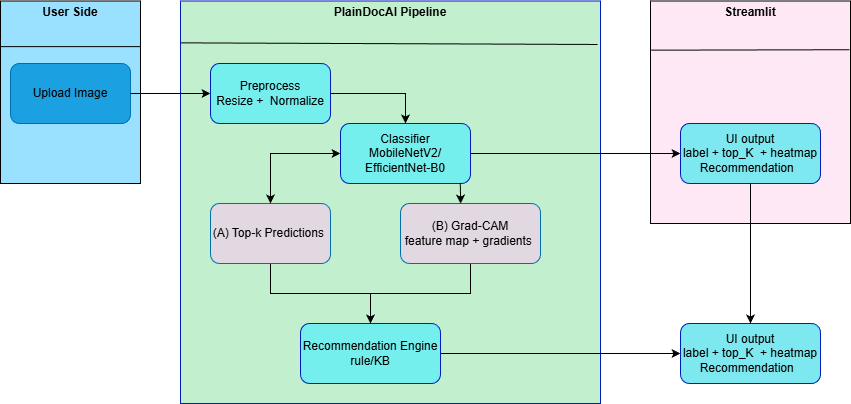

# KIẾN TRÚC HỆ THỐNG — PlantDoc AI

---

## 1. Tổng quan
PlantDoc AI là ứng dụng local-first gồm 3 lớp chính: (1) Data & Training pipeline, (2) Inference & Explainability, (3) Web UI.  
Đầu vào là ảnh lá cây, đầu ra gồm nhãn bệnh/cây, xác suất top-k, heatmap Grad-CAM và khuyến nghị xử lý.

---

## 2. Yêu cầu phi chức năng  
- Chạy local.
- Dễ demo: 1–2 lệnh chạy được.
- Mô hình inference nhanh (ưu tiên MobileNetV2/EfficientNet-B0).
- Tái lập: seed + config + log.
- Tài liệu hoá đầy đủ (proposal, evaluation, weekly logs).

---

## 3. Kiến trúc mức cao  
### 3.1 Luồng dữ liệu 
1) Dataset PlantVillage → chuẩn hoá cấu trúc thư mục / split  
2) DataLoader + transforms → training  
3) Trainer → best checkpoint  
4) Inference pipeline load checkpoint → predict top-k  
5) Grad-CAM pipeline → heatmap → overlay  
6) Streamlit UI render kết quả + recommendation + warning

### 3.2 Sơ đồ khối   

---

## 4. Thành phần chi tiết 

## 4.1 Data Pipeline
**Mục tiêu:** chuẩn hoá dữ liệu + split + dataloader chạy ổn.

`src/data/dataset.py`
  - đọc ảnh + label
  - label mapping: `label2idx`, `idx2label`
  - xử lý ảnh lỗi (try/except, log)

`src/data/transforms.py`
  - `train_transforms`: augment hợp lý
  - `val_transforms`: deterministic

`src/data/split.py`
  - split 80/10/10, seed cố định
  - lưu split files vào `data/splits/`

`scripts/smoke_dataloader.py`
  - in batch shapes, lưu sample grid ảnh

---

## 4.2 Model & Training
**Mục tiêu:** transfer learning với backbone nhẹ + lưu checkpoint best.

`src/models/backbone.py`
  - load pretrained backbone (ImageNet)
  - thay classifier head = 38 classes
  - hỗ trợ freeze/unfreeze

`src/train/trainer.py`
  - train loop + val loop
  - optimizer (AdamW/SGD)
  - scheduler (cosine/onecycle optional)
  - early stopping (optional)

`src/eval/metrics.py`
  - accuracy, f1-macro
  - confusion matrix export (png)

`scripts/train.py`
  - entrypoint train
  - save `best` checkpoint + log csv/json

`scripts/eval.py`
  - load model + run test
  - export metrics + confusion matrix

---

## 4.3 Inference
**Mục tiêu:** predict top-k ổn định, dễ tích hợp UI.

`src/infer/predict.py`
  - `load_model(checkpoint_path)`
  - `preprocess(image)`
  - `predict_topk(image, k)`
  - output: `(preds, probs)` + raw logits optional

Tối ưu:
  - cache model trong Streamlit (st.cache_resource)
  - `torch.no_grad()` / `eval()` mode

---

## 4.4 Explainability (Grad-CAM)
**Mục tiêu:** tạo heatmap đúng lớp dự đoán và overlay.

`src/xai/gradcam.py`
  - hook feature map ở conv layer cuối
  - compute gradients theo target class
  - trả ra heatmap (H×W) đã normalize

`src/xai/visualize.py`
  - resize heatmap về size ảnh gốc
  - tạo overlay (alpha blend)
  - lưu ảnh output vào `runs/gradcam_samples/`

`scripts/demo_gradcam.py`
  - input: 1 ảnh
  - output: file overlay + print predicted label

---

## 4.5 Input Validation  
**Mục tiêu:** cảnh báo ảnh không phải lá hoặc ảnh không rõ.

`src/validators/leaf_check.py`
  - MVP: kiểm tra confidence threshold + heuristics đơn giản (tùy triển khai)
  - A+: binary model leaf-vs-nonleaf (optional)

UI behavior:
  - nếu fail validation → hiển thị warning + hướng dẫn chụp lại
  - vẫn có thể cho phép “predict anyway” (optional) nhưng phải cảnh báo rõ

---

## 4.6 Recommendation Engine
**Mục tiêu:** trả nội dung nguyên nhân/cách xử lý theo bệnh.

`src/reco/recommendations.py` 
  - dict/map: `class_name -> {cause, symptoms, treatment, prevention}`
  - nội dung ngắn gọn, dễ hiểu

UI hiển thị:
  - tên bệnh
  - 3–6 bullet khuyến nghị

---

## 4.7 Streamlit UI
**Mục tiêu:** demo end-to-end.

`app/main.py`
  - upload + preview
  - button Predict
  - show top-k + confidence bar
  - show Grad-CAM overlay
  - show recommendations
  - show warning non-leaf

---

## 5. Quản lý cấu hình & reproducibility

`configs/default.yaml` 
  - paths, img_size, batch_size, lr, epochs, model_name, seed, topk

Logs:
  - `runs/logs/train_log.csv`
  - `runs/config_used.yaml`

Seed:
  - cố định random/np/torch để tái lập
 